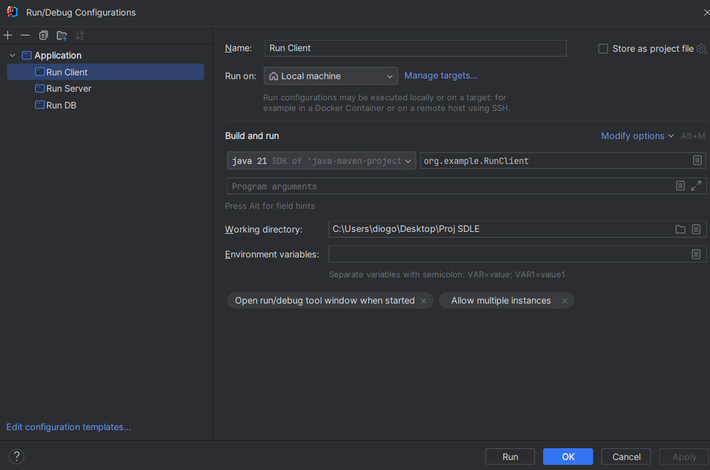
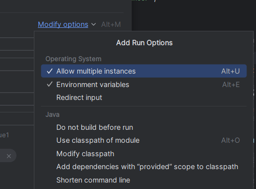

## How to run

- Import the maven project into intelliJ

- Run MiddleManServer

- Run Client

## Sugestion

In order to run multiple clients at a time it's advisable to create these Run/Debug Configurations:

Make sure to allow multiple instances for every one:

